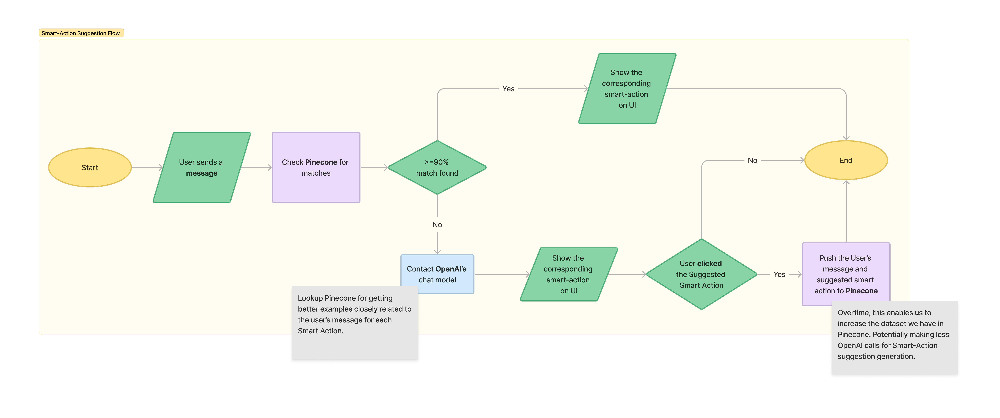

# Smart Actions suggestor based on User's message

This project is a [Next.js](https://nextjs.org/) application that uses TypeScript, React, and Tailwind, along with Langchain, OpenAI and Pincone to generate Smart Action suggestions to users based on their messages.

## Getting Started

First, install the dependencies:

```sh
npm install
```

Then, run the development server:

```sh
npm run dev
```

Open [http://localhost:3000](http://localhost:3000) with your browser to see the result.

## Project Structure
- `src/utils/openai.ts`: Contains the OpenAIUtil class for interacting with the OpenAI API.
- `src/utils/pinecone.ts`: Contains the PineconeUtil class for interacting with the Pinecone database.
- `src/app/vectordb/populate/page.tsx`: A React component that reads a dataset from a JSON file and pushes it to Pinecone.
- `src/components/Message.tsx and src/containers/ChatInterface.tsx`: React components for the chat interface.

## Environment Variables
You need to set the following environment variables in a .env.local file:

- `OPENAI_API_KEY`: Your OpenAI API key.
- `PINECONE_API_KEY`: Your Pinecone API key.
- `PINECONE_ENVIRONMENT`: Your Pinecone environment.
- `PINECONE_INDEX`: Your Pinecone index.

## Project Flow

The `Smart Action Suggestion flow` is as follows:
